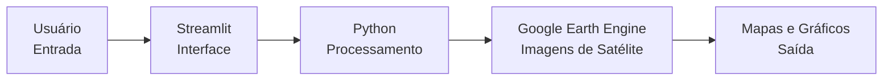
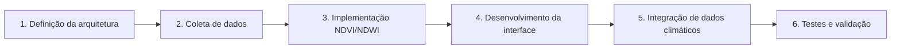

# Metodologia e Cronograma para Sistema de Monitoramento Agrícola por Imagens de Satélite

**Universidade de Passo Fundo**  
**Instituto de Tecnologia**  
**Bacharelado em Ciência da Computação**

**Autor:** Eduardo Steffens Hoppen  
**Matrícula:** 198272  
**Orientador:** Prof. Carlos Amaral Holbig  
**Local:** Passo Fundo  
**Ano:** 2026

---

## Sumário

1. [Metodologia e Cronograma](#1-metodologia-e-cronograma)
   1. [Conceitos fundamentais](#11-conceitos-fundamentais)
      1. [O que é sensoriamento remoto](#111-o-que-é-sensoriamento-remoto)
      2. [O satélite Sentinel-2](#112-o-satélite-sentinel-2)
      3. [Índices espectrais: NDVI e NDWI](#113-índices-espectrais-ndvi-e-ndwi)
         1. [NDVI](#1131-ndvi--normalized-difference-vegetation-index)
         2. [NDWI](#1132-ndwi--normalized-difference-water-index)
      4. [Google Earth Engine](#114-google-earth-engine)
   2. [Ferramentas do projeto](#12-ferramentas-do-projeto)
   3. [Metodologia para o desenvolvimento](#13-metodologia-para-o-desenvolvimento)
      1. [Etapa 1 — Definição da arquitetura](#131-etapa-1--definição-da-arquitetura-do-sistema)
      2. [Etapa 2 — Coleta de dados](#132-etapa-2--coleta-de-dados-via-earth-engine)
      3. [Etapa 3 — Implementação dos índices](#133-etapa-3--implementação-dos-índices-espectrais)
      4. [Etapa 4 — Desenvolvimento da interface](#134-etapa-4--desenvolvimento-da-interface-web)
      5. [Etapa 5 — Integração de dados climáticos](#135-etapa-5--integração-de-dados-climáticos)
      6. [Etapa 6 — Testes e validação](#136-etapa-6--testes-e-validação)
   4. [Cronograma](#14-cronograma)
   5. [Glossário](#15-glossário)
2. [Referências](#referências)

---

# 1. Metodologia e Cronograma

**Aluno:** Eduardo Steffens Hoppen — 198272  
**Orientador:** Prof. Carlos Amaral Holbig

Neste capítulo são apresentados os conceitos fundamentais necessários para a compreensão do trabalho, as ferramentas utilizadas, a metodologia detalhada de desenvolvimento e o cronograma de atividades proposto para a execução do sistema de monitoramento agrícola por imagens de satélite.

## 1.1 Conceitos fundamentais

Antes de descrever a metodologia propriamente dita, é necessário apresentar alguns conceitos básicos sobre sensoriamento remoto, imagens de satélite e índices espectrais. Esses conceitos formam a base teórica sobre a qual o sistema foi projetado.

### 1.1.1 O que é sensoriamento remoto

Sensoriamento remoto é a técnica de obter informações sobre objetos ou áreas na superfície da Terra sem estar em contato físico direto com eles. Uma câmera fotográfica comum, por exemplo, captura a luz visível refletida pelos objetos. O sensoriamento remoto funciona de maneira semelhante, mas utiliza sensores especiais instalados em satélites ou aeronaves, capazes de capturar não apenas a luz visível, mas também faixas do espectro que o olho humano não consegue perceber, como o infravermelho.

Cada material presente na superfície terrestre, como vegetação, solo, água e construções, reflete a luz de forma diferente em cada faixa do espectro eletromagnético. Essa característica é chamada de **assinatura espectral**.

A vegetação saudável reflete intensamente a luz na faixa do infravermelho próximo (**NIR**) e absorve grande parte da luz vermelha (**RED**). A vegetação estressada ou doente, por outro lado, tende a refletir menos infravermelho e mais luz vermelha. Essa diferença permite detectar alterações e possíveis problemas nas lavouras por meio de imagens de satélite.

> **Figura 1 — Conceitos espectrais**
>
> A figura original apresenta, à esquerda, a curva espectral da vegetação saudável e estressada, destacando as bandas RED e NIR usadas no cálculo do NDVI. À direita, mostra a evolução típica do NDVI ao longo do ciclo de uma cultura agrícola, desde o plantio até a colheita.

### 1.1.2 O satélite Sentinel-2

O satélite Sentinel-2 faz parte do Programa Copernicus, iniciativa da Agência Espacial Europeia que disponibiliza gratuitamente imagens de satélite de toda a superfície terrestre.

O sistema é composto por dois satélites, Sentinel-2A e Sentinel-2B, capazes de imagear um mesmo ponto do planeta em intervalos aproximados de cinco dias.

As principais características do Sentinel-2 são:

- **Resolução espacial de 10 metros:** cada pixel representa uma área de 10 m × 10 m no solo. Essa resolução permite identificar talhões agrícolas, embora não plantas individuais.
- **Treze bandas espectrais:** o sensor registra informações em faixas que vão do espectro visível ao infravermelho de ondas curtas.
- **Bandas utilizadas no trabalho:**
  - Banda 4 — vermelho, RED, 665 nm;
  - Banda 8 — infravermelho próximo, NIR, 842 nm;
  - Banda 11 — infravermelho de ondas curtas, SWIR, 1610 nm.
- **Disponibilidade gratuita:** as imagens podem ser acessadas sem custo por plataformas como o Google Earth Engine.
- **Nível de processamento 2A:** serão utilizadas imagens corrigidas atmosfericamente e representativas da reflectância de superfície.

### 1.1.3 Índices espectrais: NDVI e NDWI

Índices espectrais são fórmulas matemáticas que combinam duas ou mais bandas espectrais para destacar características específicas da superfície terrestre.

Esses índices funcionam como indicadores numéricos que resumem o estado da vegetação ou da umidade em cada pixel da imagem.

#### 1.1.3.1 NDVI — Normalized Difference Vegetation Index

O NDVI é um dos índices mais utilizados para análise de vegetação por imagens de satélite.

**Equação:**

```text
NDVI = (NIR - RED) / (NIR + RED)
```

Onde:

- **NIR** é a reflectância na faixa do infravermelho próximo, correspondente à Banda 8 do Sentinel-2, em 842 nm;
- **RED** é a reflectância na faixa do vermelho, correspondente à Banda 4 do Sentinel-2, em 665 nm.

A vegetação saudável apresenta alto valor de NIR e baixo valor de RED. Por isso, a diferença `NIR - RED` tende a ser grande e positiva. O denominador `NIR + RED` normaliza o resultado para uma faixa entre −1 e +1.

##### Interpretação dos valores de NDVI

| Faixa de NDVI | Interpretação |
|---|---|
| −1,0 a 0,0 | Corpos d’água, nuvens e neve |
| 0,0 a 0,2 | Solo exposto, áreas urbanas ou vegetação muito esparsa |
| 0,2 a 0,5 | Vegetação moderada, pastagens e arbustos |
| 0,5 a 0,8 | Vegetação densa e saudável, como lavouras no pico vegetativo |
| 0,8 a 1,0 | Vegetação muito densa, como florestas tropicais e matas fechadas |

#### 1.1.3.2 NDWI — Normalized Difference Water Index

O NDWI é complementar ao NDVI e tem como foco a estimativa da umidade presente na vegetação.

**Equação:**

```text
NDWI = (NIR - SWIR) / (NIR + SWIR)
```

Onde:

- **NIR** é a reflectância na faixa do infravermelho próximo;
- **SWIR** é a reflectância na faixa do infravermelho de ondas curtas, correspondente à Banda 11 do Sentinel-2, em 1610 nm.

O NDWI é sensível ao conteúdo de água presente nas folhas. Valores baixos podem indicar baixa umidade e possível estresse hídrico.

A combinação entre NDVI e NDWI permite uma análise mais completa:

- **NDVI:** condição e vigor da vegetação;
- **NDWI:** umidade e possível estresse hídrico.

### 1.1.4 Google Earth Engine

O Google Earth Engine, ou GEE, é uma plataforma de processamento geoespacial em nuvem que permite acessar e analisar grandes volumes de imagens de satélite e outros dados geográficos sem a necessidade de download ou armazenamento local.

O GEE pode ser entendido como um ambiente de processamento remoto: o desenvolvedor escreve scripts que são executados nos servidores da Google, onde os dados já estão armazenados e indexados.

As principais vantagens do GEE para este projeto são:

- uso gratuito para fins acadêmicos e de pesquisa;
- catálogo de imagens Sentinel-2, Landsat e MODIS;
- API Python para integração com o sistema;
- filtragem por data, localização e porcentagem de nuvens;
- cálculo de índices diretamente na nuvem;
- menor consumo de armazenamento e processamento local.

## 1.2 Ferramentas do projeto

Para o desenvolvimento do protótipo funcional foi definido um conjunto de ferramentas gratuitas e amplamente utilizadas em sensoriamento remoto, ciência de dados e prototipação.

| Ferramenta | Função |
|---|---|
| Python 3 | Linguagem principal do sistema, utilizada por sua integração com bibliotecas científicas, Google Earth Engine e ferramentas de prototipação |
| Google Earth Engine | Plataforma de processamento geoespacial em nuvem e fonte das imagens Sentinel-2 |
| Streamlit | Framework Python para desenvolvimento rápido de interfaces web |
| geemap | Biblioteca Python que integra Google Earth Engine a mapas interativos baseados em Leaflet |
| pandas / numpy | Manipulação de dados tabulares, estatística e operações numéricas |
| plotly | Geração de gráficos interativos e séries temporais de NDVI e NDWI |
| NASA POWER | Base de dados climáticos globais com precipitação, temperatura e radiação solar |

## 1.3 Metodologia para o desenvolvimento

A metodologia adotada segue uma abordagem estruturada em seis etapas sequenciais, partindo da definição conceitual até a validação do protótipo.

O método foi definido após o estabelecimento dos objetivos do trabalho e organiza os passos necessários para demonstrar que o objetivo proposto foi atingido.

### Fluxo da arquitetura do sistema



### Metodologia de desenvolvimento — seis etapas



#### Entregáveis por etapa

| Etapa | Atividade | Entregáveis |
|---|---|---|
| 1 | Definição da arquitetura | Diagrama de blocos e definição da stack tecnológica |
| 2 | Coleta de dados | Scripts Python e imagens Sentinel-2 |
| 3 | Implementação de NDVI e NDWI | Fórmulas implementadas e mapas temáticos |
| 4 | Desenvolvimento da interface | MVP funcional em Streamlit e geemap |
| 5 | Integração de dados climáticos | Dados NASA POWER e gráficos climáticos |
| 6 | Testes e validação | Métricas de validação e análise estatística |

### 1.3.1 Etapa 1 — Definição da arquitetura do sistema

**Objetivo:** projetar a estrutura geral do sistema e definir como os diferentes componentes se comunicam.

A arquitetura segue um modelo de três camadas:

1. **Camada de interface — Streamlit**
   - interação com o usuário;
   - seleção da área de interesse;
   - seleção do período de análise;
   - visualização de mapas e gráficos.

2. **Camada de processamento — Python**
   - lógica principal do sistema;
   - comunicação com a API do Google Earth Engine;
   - cálculo dos índices espectrais;
   - processamento dos dados climáticos;
   - preparação dos resultados.

3. **Camada de dados — Google Earth Engine e NASA POWER**
   - fornecimento das imagens de satélite;
   - fornecimento de dados climáticos;
   - processamento pesado realizado nos servidores remotos.

Nesta etapa será elaborado o diagrama de blocos do sistema, documentando o fluxo de dados e as interfaces entre os componentes.

### 1.3.2 Etapa 2 — Coleta de dados via Earth Engine

**Objetivo:** obter as imagens de satélite das áreas de estudo.

Serão coletadas imagens Sentinel-2 para três áreas agrícolas previamente selecionadas, representando diferentes tipos de cultura:

- soja;
- milho;
- pastagem.

A coleta será realizada por meio da API Python do Earth Engine, utilizando a biblioteca `ee`.

O processo seguirá os seguintes passos:

1. **Definição da área de interesse**
   - conversão das coordenadas geográficas de cada talhão para o formato `geometry`.

2. **Filtragem por data**
   - consulta ao período disponível;
   - foco no ano-safra 2025/2026.

3. **Filtragem por cobertura de nuvens**
   - seleção de imagens com menos de 20% de nuvens;
   - uso do metadado `CLOUDY_PIXEL_PERCENTAGE`.

4. **Seleção de bandas**
   - RED — B4;
   - NIR — B8;
   - SWIR — B11.

5. **Exportação dos metadados**
   - data de aquisição;
   - porcentagem de nuvens;
   - identificador único;
   - rastreabilidade da imagem.

### 1.3.3 Etapa 3 — Implementação dos índices espectrais

**Objetivo:** implementar o cálculo dos índices NDVI e NDWI utilizando as imagens coletadas.

Os índices serão calculados diretamente no Earth Engine por meio das operações entre bandas.

Para cada imagem da coleção, serão geradas:

- uma imagem NDVI;
- uma imagem NDWI;
- estatísticas resumidas para a área de interesse.

Os resultados incluirão:

- mapas temáticos coloridos;
  - verde para valores altos;
  - amarelo para valores médios;
  - vermelho para valores baixos;
- séries temporais de NDVI e NDWI médios;
- média;
- mediana;
- desvio padrão;
- mínimo;
- máximo.

### 1.3.4 Etapa 4 — Desenvolvimento da interface web

**Objetivo:** criar uma interface gráfica que permita ao usuário interagir com o sistema de forma intuitiva.

A interface será desenvolvida em Streamlit, com integração a geemap e plotly.

A aplicação deverá incluir:

- **Mapa interativo**
  - navegação;
  - desenho de polígonos;
  - seleção de áreas predefinidas.

- **Seletor de período**
  - controle de datas;
  - definição do intervalo temporal.

- **Seletor de índice**
  - NDVI;
  - NDWI;
  - visualização combinada.

- **Painel de mapas**
  - mapa temático;
  - escala de cores;
  - legenda.

- **Gráfico de série temporal**
  - gráfico interativo;
  - zoom;
  - seleção;
  - exportação.

- **Painel de resumo**
  - valor médio;
  - desvio padrão;
  - tendência crescente, estável ou decrescente;
  - alertas de anomalia.

### 1.3.5 Etapa 5 — Integração de dados climáticos

**Objetivo:** complementar a análise dos índices espectrais com dados climáticos, permitindo correlacionar variações na vegetação com eventos meteorológicos.

Serão utilizados dados da base NASA POWER.

As variáveis coletadas serão:

- precipitação acumulada, em milímetros por dia;
- temperatura média, em graus Celsius;
- radiação solar, em megajoules por metro quadrado por dia.

Os dados climáticos serão obtidos para o mesmo período e localização das imagens de satélite.

Exemplo de interpretação:

> Uma queda no NDVI acompanhada de período de estiagem pode indicar estresse hídrico na lavoura.

### 1.3.6 Etapa 6 — Testes e validação

**Objetivo:** verificar o funcionamento correto do sistema e validar a qualidade dos resultados.

O sistema será testado com três áreas distintas:

- soja;
- milho;
- pastagem.

Os testes serão realizados em diferentes períodos do ano-safra.

#### Procedimentos de validação

1. **Teste funcional**
   - seleção de área;
   - filtragem por data;
   - cálculo dos índices;
   - exibição de mapas;
   - geração de gráficos.

2. **Validação dos índices**
   - comparação dos valores de NDVI com faixas esperadas para cada cultura;
   - confronto com valores reportados na literatura.

3. **Detecção de anomalias**
   - identificação de períodos com desvio superior a um desvio padrão, `1σ`;
   - análise conjunta com dados climáticos.

Os resultados serão documentados e discutidos no texto final, incluindo limitações identificadas durante os testes.

## 1.4 Cronograma

O cronograma contempla as atividades previstas para o período de julho a dezembro de 2026.

Cada mês foi dividido em quatro semanas:

- S1;
- S2;
- S3;
- S4.

### 1.4.1 Tabela de atividades

| Atividade | Jul | Ago | Set | Out | Nov | Dez |
|---|---|---|---|---|---|---|
| 1. Definição da arquitetura | S1–S4 | — | — | — | — | — |
| 2. Coleta de dados | S3–S4 | S1–S4 | — | — | — | — |
| 3. Implementação NDVI/NDWI | — | S3–S4 | S1–S4 | — | — | — |
| 4. Desenvolvimento da interface | — | — | S3–S4 | S1–S4 | S1–S2 | — |
| 5. Integração de dados climáticos | — | — | — | S3–S4 | S1–S4 | — |
| 6. Testes e validação | — | — | — | — | S3–S4 | S1–S4 |
| 7. Análise e discussão dos resultados | — | — | — | S4 | S1–S4 | S1 |
| 8. Elaboração do texto final | — | — | — | S3–S4 | S1–S4 | S1–S3 |
| 9. Preparação para a defesa | — | — | — | — | — | S1–S4 |
| Banca de defesa | — | — | — | — | — | S4 |

> A distribuição acima foi transcrita a partir da tabela do documento original. Recomenda-se confirmar as marcações semanais na versão final antes da submissão.

### 1.4.2 Marcos do projeto

| Marco | Data | Descrição |
|---|---|---|
| M1 | Jul — S4 | Arquitetura do sistema definida e documentada |
| M2 | Ago — S4 | Dados das três áreas coletados e organizados |
| M3 | Set — S4 | Índices NDVI e NDWI implementados e testados |
| M4 | Out — S4 | Interface web funcional com mapa e gráficos |
| M5 | Nov — S2 | Dados climáticos integrados ao sistema |
| M6 | Nov — S4 | Testes de validação concluídos |
| M7 | Dez — S3 | Texto final revisado e entregue à banca |
| M8 | Dez — S4 | Defesa do Trabalho de Conclusão de Curso |

### 1.4.3 Descrição detalhada das atividades

#### a) Definição da arquitetura

Será projetada a arquitetura geral do sistema, definindo:

- componentes;
- fluxo de dados;
- interações entre camadas;
- comunicação entre Streamlit, Python, Google Earth Engine e NASA POWER.

O diagrama gerado servirá como guia para as etapas posteriores.

#### b) Coleta de dados

As imagens Sentinel-2 serão coletadas pelo Earth Engine para as três áreas de estudo.

Serão aplicados filtros de:

- data;
- localização;
- cobertura de nuvens.

Scripts Python automatizarão a coleta, e os metadados serão armazenados em CSV.

#### c) Implementação dos índices espectrais

Serão implementados NDVI e NDWI utilizando as funções de processamento de bandas do Earth Engine.

Para cada data disponível, serão gerados:

- mapas temáticos;
- estatísticas descritivas;
- resultados preliminares para comparação com a literatura.

#### d) Desenvolvimento da interface

A interface web será construída em Streamlit e incluirá:

- mapa interativo em geemap;
- seleção de área;
- seletor de período;
- visualização NDVI/NDWI;
- gráficos em plotly;
- painel de resumo estatístico.

#### e) Integração de dados climáticos

Serão coletados dados de:

- precipitação;
- temperatura;
- radiação solar.

Esses dados serão integrados aos índices espectrais, permitindo análise comparativa entre clima e vegetação.

#### f) Testes e validação

O sistema será submetido a testes funcionais com as três áreas de estudo.

A validação incluirá:

- comparação visual;
- análise estatística;
- registro de anomalias;
- avaliação de desvios superiores a `1σ`;
- comparação com dados climáticos.

#### g) Análise e discussão dos resultados

Os resultados serão:

- compilados;
- tabelados;
- discutidos à luz da literatura;
- comparados entre culturas;
- avaliados quanto a limitações e melhorias futuras.

#### h) Elaboração do texto final

A atividade inclui:

- redação da monografia;
- descrição do desenvolvimento;
- apresentação dos resultados;
- discussão;
- revisão bibliográfica complementar;
- revisões periódicas com o orientador.

#### i) Preparação para a defesa

Serão preparados:

- slides;
- materiais de apoio;
- roteiro de apresentação;
- ensaios;
- ajustes no texto final;
- submissão à banca.

## 1.5 Glossário

**Sensoriamento remoto:** técnica de obtenção de informações sobre a superfície terrestre sem contato físico, por meio de sensores instalados em satélites ou aeronaves.

**Banda espectral:** faixa específica do espectro eletromagnético na qual um sensor capta a radiação refletida pela superfície.

**Pixel:** menor unidade de uma imagem digital. Em imagens Sentinel-2, pode representar uma área de 10 m × 10 m.

**Resolução espacial:** tamanho da área representada por cada pixel. Quanto menor o valor, maior o nível de detalhe.

**Resolução temporal:** intervalo entre duas passagens do satélite sobre o mesmo local.

**NDVI:** índice espectral que estima a condição da vegetação a partir das bandas NIR e RED.

**NDWI:** índice espectral que estima o teor de umidade da vegetação a partir das bandas NIR e SWIR.

**NIR:** infravermelho próximo, faixa entre aproximadamente 750 e 900 nm.

**SWIR:** infravermelho de ondas curtas, faixa entre aproximadamente 1300 e 2500 nm.

**ImageCollection:** estrutura do Google Earth Engine que representa uma coleção de imagens organizadas temporalmente.

**API:** interface de programação que permite a comunicação entre sistemas.

**MVP:** Minimum Viable Product, ou Produto Mínimo Viável.

**Earth Engine:** plataforma de processamento geoespacial em nuvem da Google.

**Streamlit:** framework Python para criação de aplicações web interativas.

**Série temporal:** sequência de dados coletados ao longo do tempo.

**Anomalia:** valor que se desvia significativamente do padrão esperado.

**Reflectância:** fração da luz incidente refletida por uma superfície.

**Correção atmosférica:** processamento aplicado para remover efeitos da atmosfera sobre as imagens de satélite.

**SAVI:** Soil Adjusted Vegetation Index, índice que reduz a influência do solo exposto.

**EVI:** Enhanced Vegetation Index, índice que utiliza bandas adicionais para reduzir efeitos atmosféricos e do solo.

# Referências

EUROPEAN SPACE AGENCY. *Sentinel-2 mission guide*. 2024. Disponível em: <https://sentinels.copernicus.eu/web/sentinel/missions/sentinel-2>. Acesso em: 14 jun. 2026.

ROUSSEAUX, M. C. et al. NDVI and SAVI vegetation indices in soybean crop. *Agricultural and Forest Meteorology*, v. 125, p. 59–70, 2004.

WAZLAWICK, R. S. *Metodologia de Pesquisa para Ciência da Computação*. 2. ed. Rio de Janeiro: Elsevier, 2014.

WAZLAWICK, R. S. *Metodologia de pesquisa para ciência da computação*. 2020. Disponível em: <https://integrada.minhabiblioteca.com.br/books/9788595157712>. Acesso em: 31 mar. 2025.
